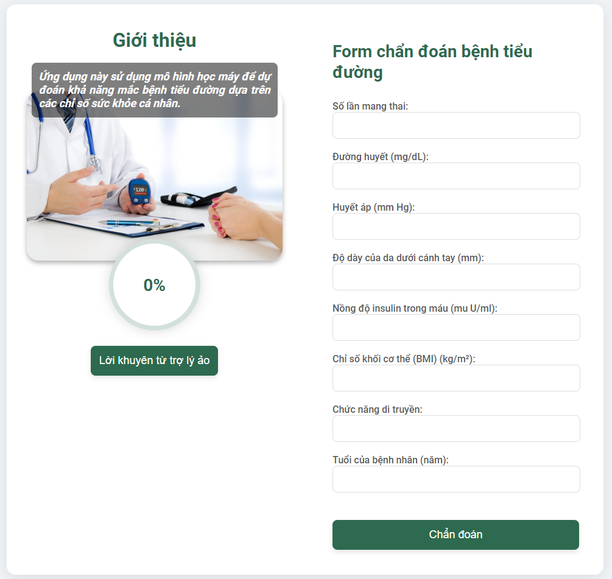
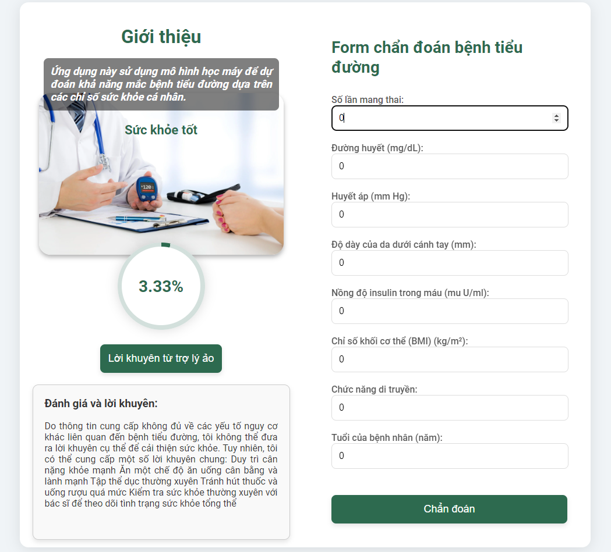

# Ứng dụng Chẩn đoán và Tư vấn Sức khỏe về Bệnh Tiểu Đường

Ứng dụng này sử dụng mô hình học máy để dự đoán khả năng mắc bệnh tiểu đường dựa trên các chỉ số sức khỏe cá nhân và cung cấp lời khuyên cải thiện sức khỏe dựa trên kết quả dự đoán.

## Tính năng

-   Dự đoán nguy cơ mắc bệnh tiểu đường dựa trên thông tin nhập từ người dùng.
-   Cung cấp lời khuyên sức khỏe cá nhân hóa để giảm nguy cơ mắc tiểu đường.

## Cài đặt

1. **Clone kho lưu trữ**:

    ```bash
    git clone https://github.com/PhamNguyenDev3/diabetes-diagnosis-advice.git
    cd diabetes-diagnosis-advice
    ```

2. **Tạo môi trường ảo và kích hoạt nó**:

    ```bash
    python3 -m venv venv
    source venv/bin/activate  # Trên Windows dùng `venv\Scripts\activate`
    ```

3. **Cài đặt các gói cần thiết**:

    ```bash
    pip install -r requirements.txt
    ```

4. **Tải tệp mô hình và đặt vào thư mục `models`**:

    - Đảm bảo bạn có tệp `random_forest_model.pkl` trong thư mục `./models/`.

5. **Chạy ứng dụng**:
    ```bash
    python app.py
    ```

## Sử dụng

1. Mở trình duyệt web và truy cập vào `http://127.0.0.1:5000/`.
2. Điền vào form với các chỉ số sức khỏe cần thiết và nhấn nút "Chẩn đoán" để nhận kết quả chẩn đoán.
3. Nhấn nút "Nhận lời khuyên" để nhận lời khuyên sức khỏe cá nhân hóa dựa trên kết quả dự đoán.

## Ảnh chụp màn hình

### Form chẩn đoán



### Kết quả chẩn đoán



## Cấu trúc thư mục

```
duan-chan-doan-tieu-duong/
├── models/
│   └── random_forest_model.pkl
├── static/
│   └── style.css
├── templates/
│   ├── index.html
│   └── index7.html
├── app.py
├── api_client.py
├── requirements.txt
└── README.md
```

## Giải thích mã nguồn

### `app.py`

Đây là tệp chính của ứng dụng, nơi thiết lập server Flask và định nghĩa các route.

-   **`/`**: Render trang chủ với form chẩn đoán.
-   **`/diagnose`**: Xử lý các yêu cầu từ form, thực hiện dự đoán nguy cơ mắc bệnh tiểu đường bằng mô hình học máy, và trả kết quả.
-   **`/get_advice`**: Cung cấp lời khuyên sức khỏe dựa trên kết quả dự đoán.

### `api_client.py`

Chứa hàm `start_chat_and_send_message` để tương tác với mô hình AI tạo lời khuyên sức khỏe.

### `templates/index.html`

Tệp HTML chính để render trang chủ và form chẩn đoán.

### `static/style.css`

Chứa CSS để tạo kiểu cho ứng dụng web.

## Đóng góp

1. Fork kho lưu trữ.
2. Tạo nhánh mới: `git checkout -b ten-nhanh-moi`.
3. Thực hiện các thay đổi và commit chúng: `git commit -m 'Thêm tính năng mới'`.
4. Đẩy lên nhánh: `git push origin ten-nhanh-moi`.
5. Tạo pull request.

## Giấy phép

Dự án này được cấp phép theo Giấy phép MIT. Xem tệp LICENSE để biết thêm chi tiết.
